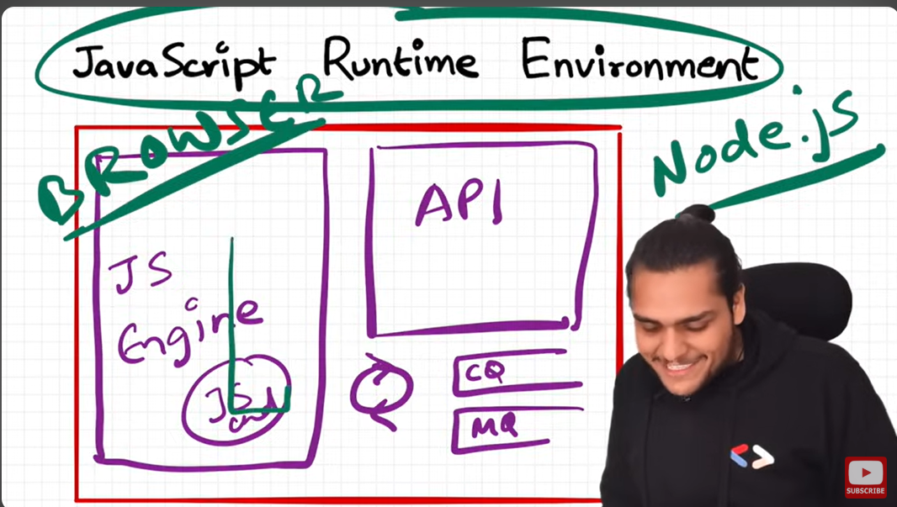
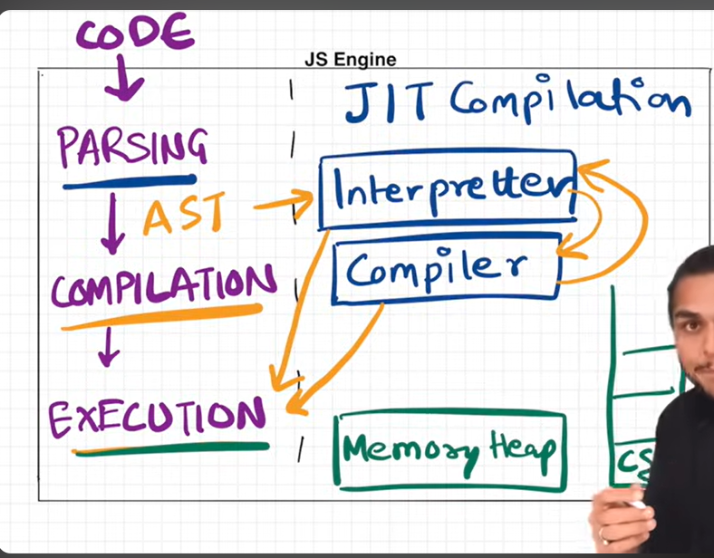
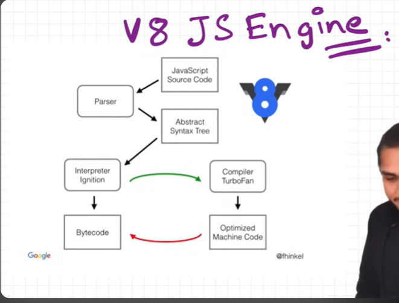

# JS Runtime Environment

- we can run JS in any environment like server, robots, watches like etc
- JS has does everything, every browser has js engines, ex: chromes uses V8 engine , Mozilla uses spidermonkey

# JS Engine

- js engine is not a machine , it is a code
- js engine runs with step by step has steps
- Code
- Parsing
  - it parses the code is broken down to token peaces "let a = 10" let is a token, a is a token, and 10 is a token
  - there is another concept is syntax parser it takes code convert into ast(abstract syntax tree)
  - try let a = 10 in astexplore.net site you will see tree structure
- Compilation
  - the AST is passed to compilation stage
  - JS has JIT(Just In Time) compilation
  - what is Interpretter language or JIT language
  - Interpretter takes code and executes line by line it does not know what is in the next line , it is faster
  - compiler - compiles entire code and modifies and iptimizes entire code then executes, it has efficiency
  - what js uses? it depends on js engines, they use interpretter plus and compiler
  - jit does optimize
  - then goes to execution
- Execution
  - it has two stages Callstack and memory heap
  - we have already seen call stack in previous classes
  - memory heap is a space where all the variables and functions are assigned memory
  - there is a Garbage Collector it uses Mark & Sweep algorithem

Quick Revision:-

- so we have this JavaScript runtime environment
- So whenever you execute any JavaScript piece of code, it needs a container
- Which has everything required to run in JavaScript code.
  That was the JavaScript runtime environment. The browser has a runtime environment (0:30) Node.js has a JavaScript runtime environment (0:32) Okay, and it constitutes of the heart of the JavaScript runtime environment, which is the JavaScript engine (0:39) It also has access to API, callback queues, event loop, and a lot of other stuff (0:45) It depends on the JavaScript runtime environment. There could be different things inside different JavaScript runtime environments (0:52) Okay, this was the first thing.
  Now let us dive deep inside these two environments, okay (0:58) This was the first thing. Now, let us dive deep inside the JS engine (1:02) Okay, so JS engine had many phases, right? (1:06) They had three phases. The code was first went through the parsing phase, the compilation phase, and the execution phase.
  In the parsing phase (1:15) Tokens are generated and after the tokens, the syntax parser basically parses the whole code and then converts it into an AST (1:22) Right, so this is that AST, that whole big tree, right? Now this AST then pass on to the interpreter (1:30) So JavaScript is a just-in-time compiled language. Remember that, okay? (1:35) Most of the modern browsers have this kind of interpreter plus compiler inside them to make this code (1:41) Optimized more and more and runs it very fast. Okay, so we have an interpreter (1:47) We have a compiler and the abstract syntax tree then goes to the interpreter.
  Interpreter produces the bytecode (1:54) Which is then being executed with the help of memory heap and the call stack (2:00) And this compiler is like constantly working upon optimizing the code as much as possible (2:05) We have a garbage collector which basically does its jobs of collecting garbage and optimize the memory space which is used by (2:12) The JavaScript engine. Okay, and we also have a lot of other optimization techniques (2:18) Go and read about all of them inlining, copy elision, inline caching. These are the most important ones.
  Go read out them (2:26) So that's all in the

Read about V8
Know about Mark and sweep, inlining, copy ehision, inline caching
