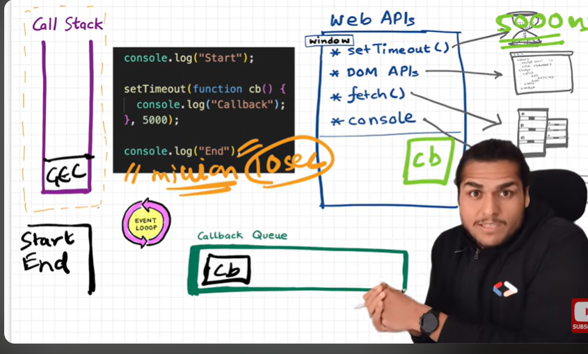

# SetTimeout issues & Concurrency model

```javascript
console.log("start");

setTimeout(function cb() {
  console.log("timer");
}, 5000);

console.log("end");
```



- it will not be executed exactly after 5 sec, it depends on the call stack status
- after setting the timer and registering the call back it will wait for timer end
  then it will be moved to call back queue
- then event loop check the call stack whether it is empty or not
- if there is millions of code to execute then execution will continue then call stack will be empty
- then only it will be moved to call stack

```javascript
console.log("start");

setTimeout(function cb() {
  console.log("timer");
}, 5000);

console.log("end");
//million
let stateDate = new Date().getTime();
let endDate = startDate;
while (endDate < startDate + 10000) {
  endDate = new Date().getTime();
}
```

- in the above example setTimeout will expires in 5 sec but waits for 10 sec
- this is concurrency model
