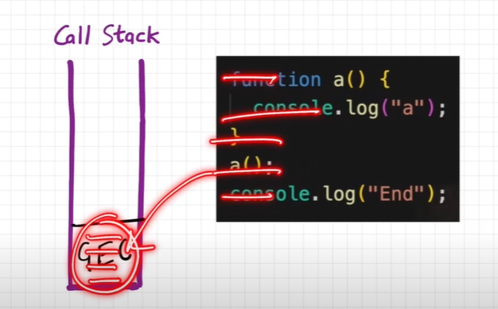
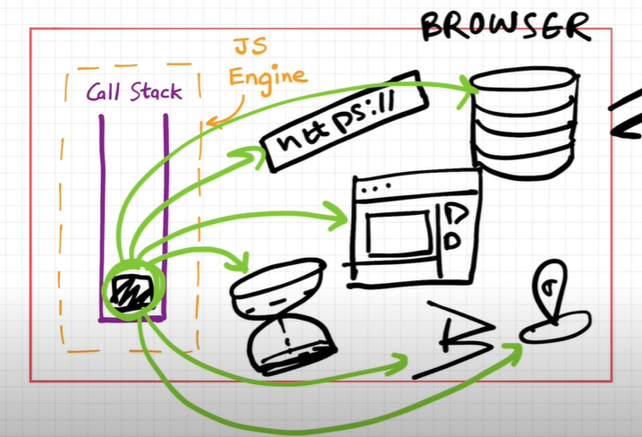
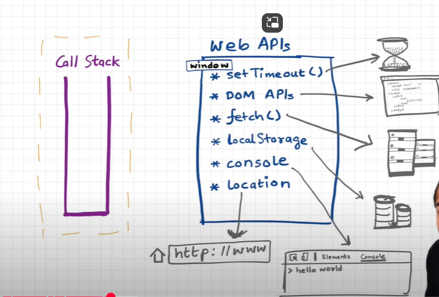
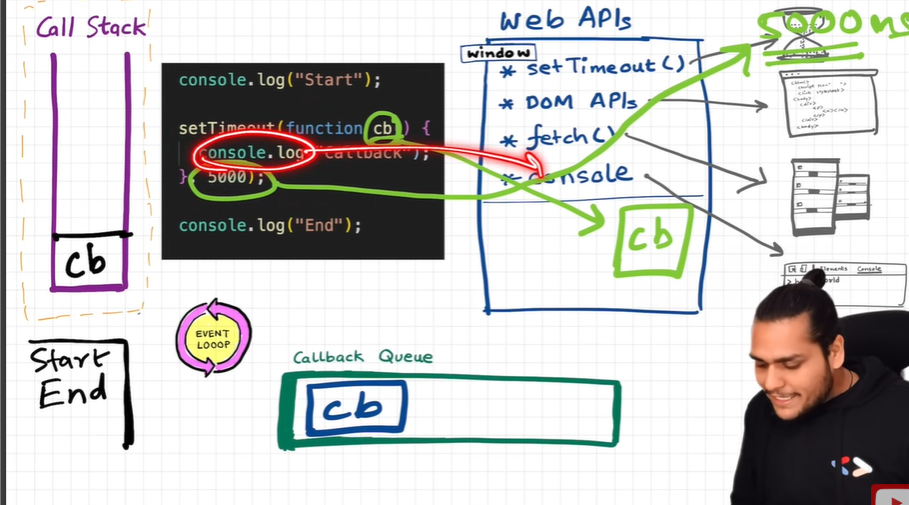

# How JS engine executes the code

- JS is the synchronous single threaded language
- It has a call stack it can only do one thing at a time
- This call stack present inside the JS engine
- All the code is executed inside the call stack

 ## Example
 ```javascript
function a(){
    console.log('a')
}
a()
console.log('End')
 ```
- Whenever any code starts executing it creates global execution context is created and pushed in to call stack


- the above code firs runs in global execution context in lines by line 

- first a will be allocated entire function and when a invokes it creates a's execution context and pushed above the GEC and when it completes execution it will be removed from the call stack
- then last line executes and GEC will also deleted from call stack
- whatever comes to the call stack it quickly executes.
- if we have to stop and execute later we need timers

# Behind scenes in the browser


- browser does the lot of things js engine present inside browser and inside callstack and inside GEC from that it access everything like url, location, bluetooth, database, servers etc.
- to access all of them we need to know about web API's

## Web API's

- let us know some of web api's 
- below things are not a part of javascript, those are browser things browser gives access to GEC to use Web api's
- all web api's are in window object example window.setTimeout(), nothing but a global object

- setTimeout
- DOM API's
- fetch
- local storage
- console
- location

### example1
 ```javascript
console.log('start')//this uses console web api
setTimeout(function a(){ // this uses setTimeOut api
    console.log('callback')
})
a()
console.log('End')
 ```
 - above code consoles start in the first line
 - set's a timer, and **call back is registered** and put's aside
 - then consoles next line
 - no lines to execute so GEC is gone, now timer is running 
 - once the timer is over it has to go back to the call stack how does this go?
 - it goes to the call back through the **callback queue**  
 - once the timer is over call back function moves inside the call back queue who moves?
 - **Event Loop** has job that checks if there is anything the callback queue it checks and moves in to the call stack then it executes
 - it has console in call back it executes 
 - as shown in below image
 

 ### example2