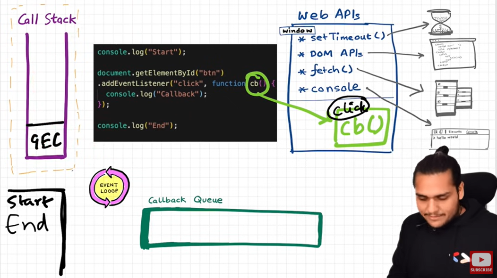
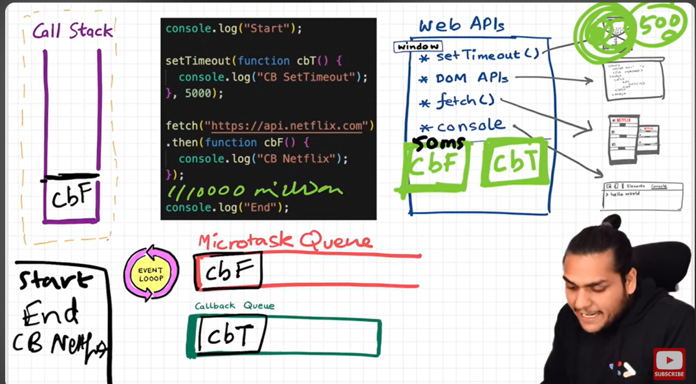

# How JS engine executes the code

- JS is the synchronous single threaded language
- It has a call stack it can only do one thing at a time
- This call stack present inside the JS engine
- All the code is executed inside the call stack

 ## Example
 ```javascript
function a(){
    console.log('a')
}
a()
console.log('End')
 ```
- Whenever any code starts executing it creates global execution context is created and pushed in to call stack


- the above code firs runs in global execution context in lines by line 

- first a will be allocated entire function and when a invokes it creates a's execution context and pushed above the GEC and when it completes execution it will be removed from the call stack
- then last line executes and GEC will also deleted from call stack
- whatever comes to the call stack it quickly executes.
- if we have to stop and execute later we need timers

# Behind scenes in the browser


- browser does the lot of things js engine present inside browser and inside callstack and inside GEC from that it access everything like url, location, bluetooth, database, servers etc.
- to access all of them we need to know about web API's

## Web API's

- let us know some of web api's 
- below things are not a part of javascript, those are browser things browser gives access to GEC to use Web api's
- all web api's are in window object example window.setTimeout(), nothing but a global object

- setTimeout
- DOM API's
- fetch
- local storage
- console
- location

### Example1 setTimeout and Console

 ```javascript
console.log('start')//this uses console web api
setTimeout(function a(){ // this uses setTimeOut api
    console.log('callback')
})
console.log('End')
 ```
 - above code consoles start in the first line
 - set's a timer, and **call back is registered** and put's aside
 - then consoles next line
 - no lines to execute so GEC is gone, now timer is running 
 - once the timer is over it has to go back to the call stack how does this go?
 - it goes to the call back through the **callback queue**  
 - once the timer is over call back function moves inside the call back queue who moves?
 - **Event Loop** has job that checks if there is anything the callback queue it checks and moves in to the call stack then it executes
 - it has console in call back it executes 
 - as shown in below image
 

 ### Example2 DOM and Console

 

 ```javascript
console.log('start')//this uses console web api
document.getElementById("clickMe") // this uses dom apis's
    .addEventListener("click", function btn(){ //eventListener also dom
    console.log('clicked')
    })
console.log('End')
```
- as usual when JS starts executing the code line by line, creates GEC and pushed to call stack
- line one executes uses console web api and consoles start
- line two uses dom api and get's button element and add event listener is also dom web api it registers call back function that is click event then it moves
- line three also same as line one

- call back method waits until user clicks 
- when clicks that comes to the call back queue
- Event loop has one job , is to monitor call stack and call back queue if it sees call stack is empty and it sees call back queue has something so it moves queue thing to call stack 

- Why do we need call back queue?
- suppose user clicks 5 times button there will be five clicks and they put in call back queue, so then event loop moves them slowly to callstack

 ### Example3 fetch

- fetch is also web api which is used to make network basically goes and request api call returns a promise, we need call back function to resolve promise

 

 ```javascript
console.log('start')//this uses console web api
setTimeout(function cbT(){ // this uses setTimeOut api
    console.log('callback timeout')
})
fetch("https://api.netflix.com")
.then(function cbF(){
    console.log("call back netflix")
})
//100 lines of code
console.log('End')
```
- as usual line one executes 
- line two sets a timer and registers call back function in web environment
- In the next step is fetch it starts connecting to servers and it takes few moments 
- now we have two CB's registered 
- as we know once timer is over cbT goes to call back queue
- we have another queue called ***Micro Task Queue*** that will holds high priority CB's
- event loop executes all Micro Task Queue tasks and later goes to call back queue tasks
- fetch is priority so it goes to Micro Task Queue 
- when callstack is empty it pushed fetch CBT to call stack once it executes as Micro Task Queue is empty now it checks call back queue now it pushes timer call back

What can come Micro Task Queue?

- All the call back functions which comes from promises
- And mutation observer goes inside the Micro Task Queue
- other call back function goes inside call back queue

- some call call back queue as Task queue

- when one Micro Task  creates another and another creates another then call back queue does not get chance that is STARVATION
